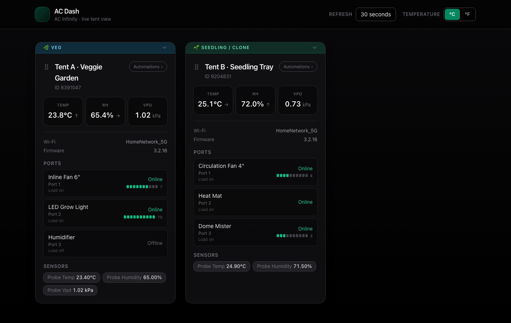

# AC Dash

> **Docker (recommended)** — pull from GitHub Container Registry:
>
> ```bash
> docker pull ghcr.io/ajankuv/acdash:latest
> ```
>
> [**All image tags**](https://github.com/ajankuv/acdash/pkgs/container/acdash) · [Deploy](#deploy)

A web dashboard for **AC Infinity UIS controllers** that does everything the mobile app does on the cloud side — live sensor readings, history charts, port control, and automation management — from any browser on your LAN.



---

## Why I built this

I **vibe-coded** this for my own use. I kept opening my phone to check on the winter veggie garden I keep with my daughter. I wanted that same snapshot on a big screen, running in **Docker**, easy to manage in **Portainer**, and reachable from other machines on the network without another login flow every time. The UI uses **Tailwind** with a **dark theme** deliberately in the spirit of AC Infinity's app (cards, hierarchy, calm greens) — not a pixel-perfect copy, but familiar enough that it feels like the same ecosystem.

What started as a read-only monitor grew into a full dashboard once I reverse-engineered enough of the API to understand the write paths too.

---

## What it does

**Live monitoring**
- Temperature, humidity, VPD, and port states for all your controllers
- Trend arrows on sensor readings
- Fan speed bars per port
- Grow stage labels per controller (Seedling, Veg, Flower, Drying) — stored locally, not in the AC Infinity cloud
- Fullscreen / TV mode for a wall display
- Auto-refresh from 1 second to 60 seconds, or manual

**History charts**
- Charts powered by a local SQLite database that collects one reading per controller every 60 seconds
- AC Infinity's cloud only keeps ~30 days; local history is indefinite — leave the container running and it builds up automatically
- Time windows from 6 hours to 30 days; falls back to the cloud API if local data doesn't cover the range yet

**Port control**
- Click any port on a card to open a control modal
- Supports all modes: **Manual** (on/off + speed), **Auto** (temperature/humidity triggers), **VPD**, **Cycle**, **Schedule**, **Timer**, **Off**
- **Auto mode**: set high/low temperature and humidity trigger thresholds (in your chosen °C/°F unit) plus the triggered and idle fan speeds — the same temp/humidity trigger the official app calls Auto
- Read-before-write: fetches the full current settings record first and echoes it back with your changes overlaid, so nothing gets silently overwritten (a partial payload is what the AC Infinity API rejects)
- Confirm-once flow — one tap to review, one to execute
- 1.5 s rate limit between writes to match the AC Infinity API's own enforcement
- Note: after changing a port's **mode**, the cloud reports the new mode on a short device-check-in delay, so the card may show the previous mode for one refresh cycle before it catches up (threshold and speed values update immediately)

**Automation management**
- "Automations ›" button on each controller card lists all named automation programs
- Toggle programs on/off, delete them, or create new ones
- Port assignment uses the same bitmask encoding the official app uses

---

## Requirements

- Docker (or any container runtime — Portainer, Unraid, etc.)
- AC Infinity cloud login (same email/password as the mobile app)

---

## Deploy

### Local Docker

```bash
docker run -d \
  --name acdash \
  -p 8080:8080 \
  -v acdash_data:/app/data \
  --restart unless-stopped \
  ghcr.io/ajankuv/acdash:latest
```

Open **http://localhost:8080**. First visit shows a setup form; enter your AC Infinity credentials once and they're saved to the volume. After that it goes straight to the dashboard.

### Portainer / compose

Use the `docker-compose.yml` in this repo as a Portainer stack, or paste it into the Web editor:

```yaml
services:
  acdash:
    image: ghcr.io/ajankuv/acdash:latest
    container_name: acdash
    restart: unless-stopped
    ports:
      - "8080:8080"
    volumes:
      - acdash_data:/app/data

volumes:
  acdash_data:
```

**To update:** pull and redeploy the stack. The `/app/data` volume keeps credentials and history across recreates.

**Headless mode** (skip the setup wizard entirely): add these to the stack environment:

```
ACDASH_USE_ENV_CREDENTIALS=1
ACINFINITY_EMAIL=you@example.com
ACINFINITY_PASSWORD=yourpassword
```

### Environment variables

| Variable | Default | What it does |
|----------|---------|-------------|
| `PORT` | `8080` | Listen port inside the container |
| `CACHE_SECONDS` | `45` | How long to cache the live snapshot |
| `COLLECTOR_INTERVAL_SECONDS` | `60` | How often to write a reading to the local history DB |
| `HISTORY_DB_PATH` | `/app/data/history.db` | Path to the SQLite history file |
| `HISTORY_CACHE_SECONDS` | `300` | How long to cache chart responses in memory |
| `LOG_LEVEL` | `INFO` | `INFO` or `DEBUG` |
| `ENV_FILE_PATH` | `/app/data/.env` | Where wizard-saved credentials are written |
| `ACDASH_USE_ENV_CREDENTIALS` | — | Set to `1` to use `ACINFINITY_EMAIL`/`PASSWORD` from env instead of the wizard |

---

## Credentials and security

AC Dash needs your AC Infinity cloud email and password to call their API on your behalf.

- Credentials are written to **`/app/data/.env`** inside the container after the setup wizard. Mount a volume on `/app/data` so they survive container recreates.
- **Nothing is sent to this project's author** or any third party. All traffic goes directly to `acinfinityserver.com` — the same server the mobile app talks to.
- The AC Infinity API uses plain HTTP (not HTTPS) — this is on their end, not ours. Run AC Dash on a trusted network.
- Don't paste the debug JSON dump (`/api/debug/ac-infinity-dump`) into public issues — it contains device IDs, Wi-Fi names, and account fields.

---

## API notes

AC Infinity doesn't publish a public API spec. Everything here comes from watching real responses, comparing them to equipment identified port-by-port in the app, and cross-checking with the Jadx-decompiled Android client. Key findings are in [`AC_INFINITY_FIELDS.md`](AC_INFINITY_FIELDS.md) and the `RND/` directory.

Treat all of it as **observed behavior**, not a guarantee. If you find new device combinations, extending those docs helps everyone.

---

## Credits

The cloud API shape and VPD/sensor scaling model lean heavily on community work. Huge thanks to **[LukeEvansTech/acinfinity-exporter](https://github.com/LukeEvansTech/acinfinity-exporter)** — that Prometheus exporter was the reference that made talking to the same HTTP API approachable.

Not affiliated with AC Infinity.

---

## License

**MIT** — see [`LICENSE`](LICENSE). If you fork or ship this, keep the credit to acinfinity-exporter and respect AC Infinity's terms for API use.
